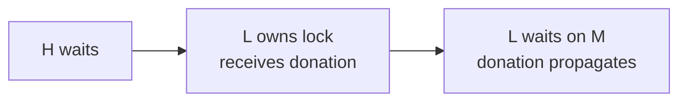

# 04 — PI Priority Propagation: The Later Consumer

[简体中文](zh-CN/04-fire-walk.md) · [Project home](../README.md)

> The historical filename is retained for link compatibility. This document explains a legitimate scheduler mechanism that consumes corrupted state; it does not document a trigger sequence.

## Conclusion

The priority-chain walk is not a second root bug. It is the normal mechanism that makes priority inheritance correct across nested locks. The defect from [03](03-stack-write.md) becomes dangerous because the walk later treats `task->pi_blocked_on` and cached waiter trees as authoritative kernel-owned state.

## Why propagation is required

Suppose high-priority task H waits on a lock held by low-priority task L. PI temporarily boosts L so it can release the lock promptly. If L is itself blocked on a lock held by M, boosting only L is insufficient; the donation must continue to M. This recursive correction is the purpose of `rt_mutex_adjust_prio_chain()`.



Lock/unlock, timeout, signal cleanup, ownership changes, and task priority/policy changes can all require recalculation. These are legitimate events, not vulnerability behavior.

## Task-side PI model in the supplied image

| Offset | Field meaning | Consumer role |
| --- | --- | --- |
| `task+0x84` | effective priority | Compare/update donation order |
| `task+0x360` | deadline key | Tie-break deadline entities |
| `task+0x86c` | `pi_lock` | Protect task PI state |
| `task+0x880` | `pi_waiters.rb_root.rb_node` | Empty/root check |
| `task+0x888` | `pi_waiters.rb_leftmost` | Cached highest-priority waiter |
| `task+0x890` | `pi_top_task` | Current top donor selected by scheduler |
| `task+0x898` | `pi_blocked_on` | Continue propagation to the next lock |

The structure layout used to interpret those trees is documented in [06](06-static-analysis.md).

## Instruction-level consumption

At entry to one chain step, the function reads the current task's blocked-on waiter:

```asm
rt_mutex_adjust_prio_chain (rel 0x225C68)
+0x00d8  ldr  x28, [x19, #0x898]  // task->pi_blocked_on
```

It then tests the owner's cached PI waiter tree and converts the cached leftmost RB node back into its enclosing waiter. In this image, the subtraction constant is exactly `0x18` because `pi_tree_entry` is at waiter offset `+0x18`:

```asm
rt_mutex_adjust_prio_chain
+0x0104  add  x8, x19, #0x880
+0x0108  ldar x8, [x8]             // cached tree root
+0x010c  cbz  x8, ...
+0x0110  ldr  x8, [x19, #0x888]   // rb_leftmost
+0x0114  sub  x8, x8, #0x18       // enclosing waiter
```

After tree maintenance, it derives the top waiter task and recalculates effective scheduling priority:

```asm
rt_mutex_adjust_prio_chain
+0x115c  add  x8, x19, #0x880
+0x1160  ldar x8, [x8]
+0x1164  cbz  x8, ...              // empty tree selects NULL donor
+0x1168  ldr  x8, [x19, #0x888]
+0x116c  ldr  x1, [x8, #0x18]     // pi_node + 0x18 == waiter->task
+0x1170  mov  x0, x19
+0x1174  bl   rt_mutex_setprio
```

An empty tree does not suppress the call; it supplies a NULL donor so the owner can return toward normal priority.

## How stale state is re-consumed

Under the broken cleanup invariant, a task may return from the proxy wait path while `pi_blocked_on` still refers to a waiter that lived on a completed kernel stack frame. Later priority recalculation reads that pointer as if the task were still blocked. The walk can then:

- interpret reused bytes as waiter fields;
- follow a lock or owner relationship that never existed;
- rebalance RB-tree state using inconsistent membership;
- pass an unintended donor task to `rt_mutex_setprio()`.

The exact consequence depends on memory reuse and interleaving. The repair should therefore eliminate the stale producer rather than add ad-hoc pointer range checks to every consumer.

## `rt_mutex_setprio()` and CFI

In this image, the selected effective priority chooses deadline (`w25 < 0`), real-time (`0..99`), or fair (`>99`) scheduling. The scheduler writes one of three static `sched_class` objects to `task+0x98`. CFI validates later indirect callback targets; it does **not** prove that the task, waiter, RB node, or scheduling-class pointer was obtained from a live object. A bad structure pointer may fault before CFI is reached.

## Repair rationale

Once `remove_waiter()` clears the real waiter's `pi_blocked_on` under the real waiter's `pi_lock`, the later walk sees no blocked-on edge to follow. That restores the abstraction boundary: propagation can continue to trust kernel-owned PI state without expensive lifetime validation at every read.

Hardening assertions in debug builds are still valuable, but the production fix belongs at the cleanup site that violates the invariant.
