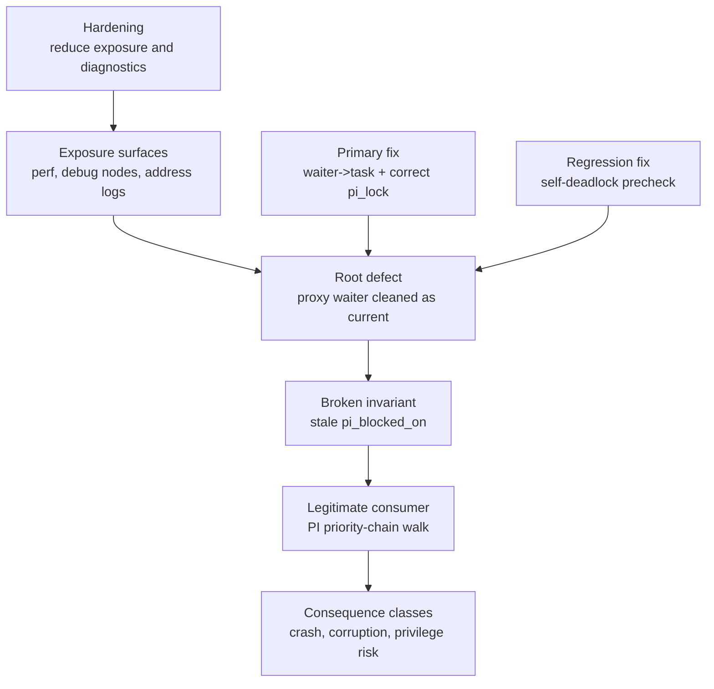

# Defensive Research Map

[简体中文](zh-CN/research-map.md) · [Project home](../README.md)

## Scope model

This map separates the kernel defect from environmental amplifiers and later consumers. It is a repair map, not an exploitation recipe.

## Node table

| Node | Kernel design intent | Failure or exposure | Defensive closure |
| --- | --- | --- | --- |
| D0 Provenance | Tests should execute reviewed artifacts | Opaque shared libraries execute with the caller's authority | Source review, reproducible build, SHA-256, isolated device |
| D1 Address confidentiality | KASLR raises the cost of address prediction | Permissive perf/debug paths can reveal address-correlated information | Restrict access; remove address-bearing production logs |
| D2 Proxy locking | Requeue-PI may manipulate a waiter for another task | Cleanup historically assumed `current == waiter->task` | Use the waiter-owned task consistently |
| D3 Lifetime | `pi_blocked_on` is valid only while the waiter exists | Wrong-task cleanup leaves a stack-backed pointer stale | Clear under `waiter->task->pi_lock` before lifetime ends |
| D4 Propagation | Priority donation must traverse nested lock owners | The walk trusts internal PI invariants and follows stale state | Repair producer/cleanup; add debug assertions for validation |
| D5 Regression | Deadlock rollback must accept partial initialization | Follow-up paths may reach cleanup with NULL waiter task | Include CVE-2026-53166 self-deadlock guard |
| D6 Release | Vendor kernels use backports | Version-only scanners can misclassify | Verify code pattern or vendor patch provenance; reboot and test |

## Test device

All tests and code in this repository are based on the following device:

| Property | Value |
| --- | --- |
| `ro.product.model` | V2314A |
| `ro.product.board` | k6895v1_64 |
| `ro.board.platform` | mt6895 |
| `ro.product.platform` | (empty) |
| `ro.product.cpu.abi` | arm64-v8a |
| `ro.product.manufacturer` | vivo |
| `ro.product.brand` | vivo |
| `ro.product.device` | PD2314 |
| `ro.product.name` | PD2314 |
| `ro.hardware` | mt6895 |
| `ro.build.fingerprint` | vivo/PD2314/PD2314:15/AP3A.240905.015.A2/compiler260617110852:user/release-keys |
| `ro.build.display.id` | PD2314_A_15.2.18.0.W10 |
| `ro.build.id` | AP3A.240905.015.A2 |
| `ro.build.tags` | release-keys |
| `ro.build.type` | user |
| `uname -r` | 5.10.233-android12-9-g44ec642832da-dirty |

## Trust boundaries

The most important boundary is **before execution**. Documentation, source, and logs are data. A shared `.so`, binary, APK, kernel module, or build script is active code. Loading it on a workstation with ADB access exposes both the workstation and the device. A checksum confirms identity, not safety; it is useful only after reviewers have established which source and build the checksum represents.

## Kernel invariants to audit

1. If `task->pi_blocked_on != NULL`, the task is genuinely blocked on the referenced PI waiter and that waiter is live.
2. Mutations of a task's PI state occur while holding that same task's `pi_lock`.
3. RB-tree membership, `rb_leftmost`, and waiter ownership agree before and after enqueue, dequeue, rollback, timeout, and signal exits.
4. Proxy operations never substitute the executing task for the waiter-owned task.
5. Cleanup tolerates every initialization state reachable from an early error.

## Release gates

| Gate | Pass condition | Evidence |
| --- | --- | --- |
| Source gate | Vendor tree contains the semantic upstream fix and follow-up guard | Reviewed diff with commit provenance |
| Build gate | Running image contains the intended task-selection pattern | Disassembly/code-pattern audit |
| Functional gate | Normal PI, timeout, signal, requeue, and deadlock behavior remains correct | Kernel selftests/LTP plus vendor tests |
| Stress gate | No stale PI state, lockdep warning, KASAN/KCSAN report, or RB corruption | Sanitized engineering build under stress |
| Product gate | Production debug surfaces follow least privilege | Configuration and SELinux policy review |

## Non-claims

This repository does not claim that every kernel with the same version string is affected, that exposure hardening replaces the semantic fix, or that a successful laboratory trigger proves a production fleet is uniformly vulnerable. Vendor backports and build configuration must be checked per released image.
