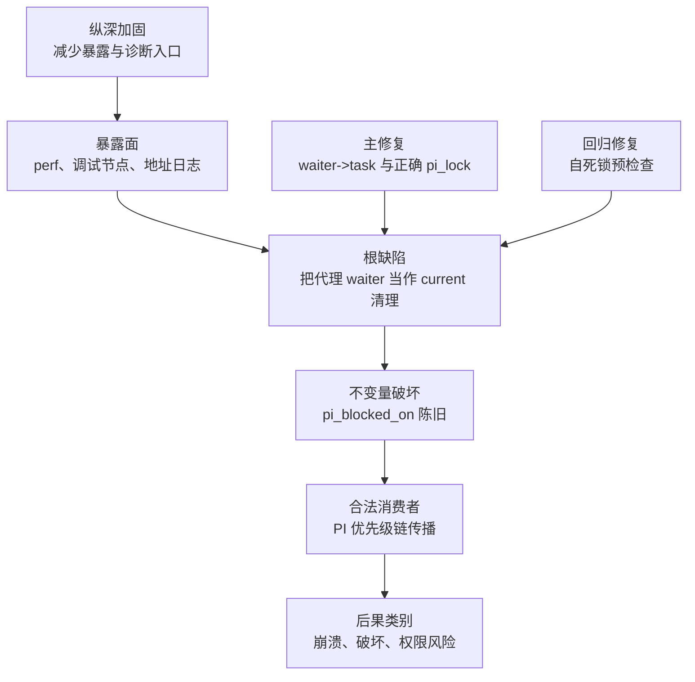

# 防御性研究地图

[English](../research-map.md) · [项目首页](../../README.zh-CN.md)

## 范围模型

本地图把内核根缺陷、环境放大器和后续消费者分开。它是修复地图，不是利用配方。

## 节点表

| 节点 | 内核设计原意 | 失效或暴露 | 防御闭环 |
| --- | --- | --- | --- |
| D0 产物来源 | 测试只应执行已审查产物 | 不透明共享库以调用者权限运行 | 源码审查、可复现构建、SHA-256、隔离设备 |
| D1 地址保密 | KASLR 增加地址预测成本 | 宽松 perf/调试路径可泄露地址相关信息 | 限权；移除生产地址日志 |
| D2 代理加锁 | requeue-PI 可代替另一任务操作 waiter | 历史清理假定 `current == waiter->task` | 始终使用 waiter 所属任务 |
| D3 生命周期 | 仅在 waiter 存活时 `pi_blocked_on` 才有效 | 清错任务会留下指向栈对象的陈旧指针 | 生命周期结束前在真实任务 `pi_lock` 下清零 |
| D4 传播 | 优先级捐赠须跨嵌套锁 owner 传播 | walk 信任 PI 内部不变量并跟随陈旧状态 | 修复生产/清理端；验证构建加入断言 |
| D5 回归 | 死锁回滚须容忍部分初始化 | 后续路径可能用 NULL waiter task 进入清理 | 纳入 CVE-2026-53166 自死锁保护 |
| D6 发布 | 厂商内核使用补丁回移 | 仅按版本扫描可能误判 | 核验代码模式或厂商补丁来源；重启后测试 |
| D7 后续消费者 | 内核模块应仅在已验证环境加载 | APP seccomp 崩溃驱使手动 insmod 绕过 vermagic | 记录 KSU 内核模块授权流程（见 07-ksu-grant） |

## 信任边界

最重要的边界发生在**执行之前**。文档、源码和日志是数据；共享 `.so`、二进制、APK、内核模块和构建脚本是主动代码。把它加载到具有 ADB 权限的工作站，会同时暴露工作站和设备。摘要只能证明文件身份，不能证明安全；只有先明确被审查的源码与构建关系，摘要才有意义。

## 必须审计的内核不变量

1. 若 `task->pi_blocked_on != NULL`，任务确实阻塞在所指 PI waiter 上，且 waiter 仍存活。
2. 修改任务 PI 状态时，持有的必须是同一任务的 `pi_lock`。
3. enqueue、dequeue、回滚、超时和信号退出前后，RB 树成员、`rb_leftmost` 与 waiter 所属任务一致。
4. 代理操作绝不以执行者任务替代 waiter 所属任务。
5. 清理逻辑能安全处理所有由早期错误产生的初始化状态。

## 发布关卡

| 关卡 | 通过条件 | 证据 |
| --- | --- | --- |
| 源码关 | 厂商树包含上游语义修复与后续保护 | 带来源的差异审查 |
| 构建关 | 运行镜像包含预期任务选择模式 | 反汇编/代码模式审计 |
| 功能关 | 普通 PI、超时、信号、requeue 和死锁语义正常 | 内核 selftests/LTP 与厂商测试 |
| 压力关 | 无陈旧 PI 状态、lockdep、KASAN/KCSAN 或 RB 树报告 | 带检测器工程构建压力测试 |
| 产品关 | 生产调试面符合最小权限 | 配置与 SELinux 策略审查 |

## 不作出的主张

本仓库不声称同版本字符串的所有内核均受影响，不声称关闭暴露面能替代语义修复，也不把一次实验室触发等同于整个量产机群均有漏洞。必须逐个发布镜像核验厂商回移补丁和构建配置。
